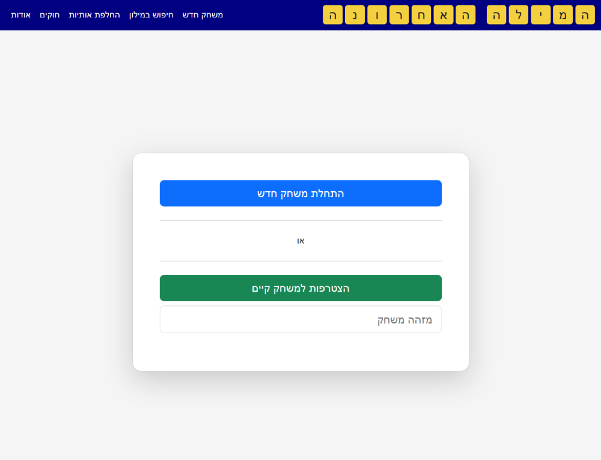

<h1>המילה האחרונה - משחק דמוי "שבץ נא" אונליין</h1>

זהו משחק דמוי "שבץ נא" אונליין לשחקן יחיד (מול המחשב) או לשני שחקנים. 
ניתן לשחק במשחק <a href="https://dvd848.github.io/the-last-word/">כאן</a>.

# The Last Word

"The Last Word" is an online Scrabble™-like game in Hebrew. Users can choose to play the game individually against the computer or with a partner in a two player mode. The game is available online [here](https://dvd848.github.io/the-last-word/).

## Dictionary

By default, the game only accepts words which are included in its internal dictionary.  
Since the official Hebrew Scrabble™ is not freely available (if it even exists), 
the next best option was to base the dictionary on [Hspell](http://hspell.ivrix.org.il/), the Hebrew spell-check project.
However, this is far from being ideal for several reasons:
 1. The amount of words accepted by a spellchecker is much larger than the amount of words legal in Scrabble™. 
    For example, a spellchecker would accept "מכוניתי" and "מכוניותיכן" while in scrabble we'd only want to accept "מכונית".
 2. Hspell was designed to be 100% and strictly compliant with the official niqqud-less spelling rules published by the Academy of the Hebrew Language. 
    However, a few of the Academia's official spelling decisions are relatively unknown to the general public, and sometimes even disputed by popular publishers.
    For example, it won't accept "אמא" (officially, the correct word is "אימא") or "אמיתי" (officially should be "אמתי").
 3. While probably being the most extensive source of Hebrew words openly available, it is not complete, and hasn't been updated for a few years.
 4. Hspell contains also names and other types of words which shouldn't be accepted in a Scrabble™ game.

Therefore, an attempt was made to select only a subset of the words accepted by Hspell. Details on the process are available [here](https://github.com/Dvd848/the-last-word/tree/main/utils/words).

As a partial mitigation, it's possible to force the game to accept the words in a certain move by using an "objection". Alternatively, it's possible to disable the dictionary-check via the Settings menu of the game.  
Suggestion for alternative dictionaries are welcome (the dictionaries must have a license compatible with "The Last Word"'s own license as listed below).

## References

### Computer AI

The computer's AI is based on a paper by Andrew W. Appel and Guy J. Jacobson titled "[The World’s Fastest Scrabble Program](https://www.cs.cmu.edu/afs/cs/academic/class/15451-s06/www/lectures/scrabble.pdf)". For whoever's interested in diving into the algorithm, there's a good video walkthrough [here](https://www.youtube.com/watch?v=9cytoYiF9uY).

Currently the AI supports two difficulty levels:

 * Novice: The computer randomly selects a legal move
 * Expert: The computer selects the move that will maximize the amount of points for the current turn

### Dictionary Storage

The dictionary is stored as a DAWG (Directed Acyclic Word Graph) which significantly reduces its size. 
In addition, given a prefix, this data structure allows iterating all the next-letters for all the words that start with the given prefix. 
Such an ability is needed in order to implement the algorithm listed above.

## Alternatives

There are a few alternatives for a Hebrew Scrabble™-like game online:
 * [Snopi's Bonus for one player](https://snopi.com/xGames/Bonus/BonusIntro.aspx)
 * [Snopi's Bonus for two players](https://snopi.com/xGames/Bonus/BonusIntroTwo.aspx)
 * [Bonus](https://www.old-games.org/onlineGame/bonus)
 * [Android Application](https://play.google.com/store/apps/details?id=com.beno.Words)

## Development

I developed this game as a side project in order to get familiar with Typescript.  
All the logic is implemented on the client side and only requires a static server.

The project includes a Docker file that can be used to setup the game locally.  

### Developing / Running Locally

 1. Build the container with `docker-compose up -d --build`
 2. Run the container with `docker-compose up -d`
 3. Attach to the container with `docker-compose exec app sh`
 4. (First time only) Install the packages from `npm` using `npm install`
 5. (First time only) Install the server packages from `npm` using `cd server && npm install && cd ..`
 6. In one terminal, run `npm watch-client` to start watching client side code
 7. In another terminal, run `npm run dev` to start the server
 8. When done, execute `exit` to exit the shell
 9. Execute `docker-compose down` to stop the container

For the online version hosted in GitHub Pages, changes to the Typescript files only take effect once the code is bundled and submitted to GitHub.

## License

"The Last Word" is released under [AGPLv3](https://www.gnu.org/licenses/agpl-3.0.en.html).

"The Last Word" utilizes the [Hspell](http://hspell.ivrix.org.il/) Dictionary as part of its functionality. This dictionary is released under [AGPLv3](https://www.gnu.org/licenses/agpl-3.0.en.html)

The dictionary's DAWG is generated by [dawgdic](https://code.google.com/p/dawgdic/) and is extracted on the client side by logic ported to Typescript from the [DAWG-Python](https://github.com/pytries/DAWG-Python) project (which was released under MIT license).

"The Last Word" is not officially affiliated with Scrabble™ or with Hasbro / Mattel.