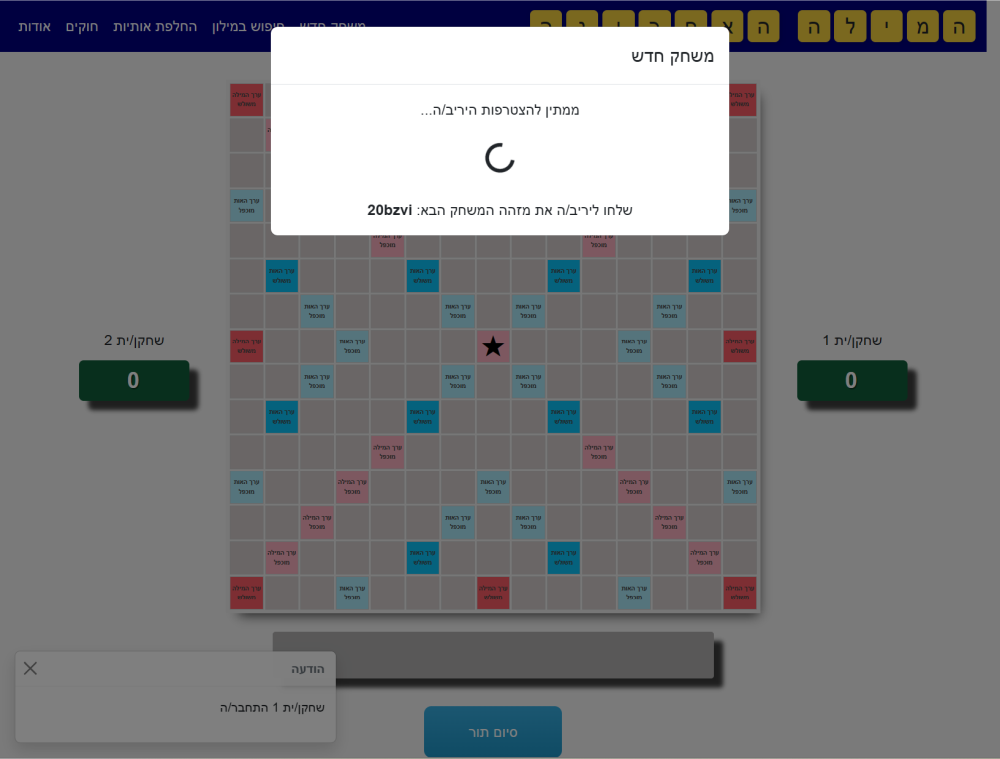
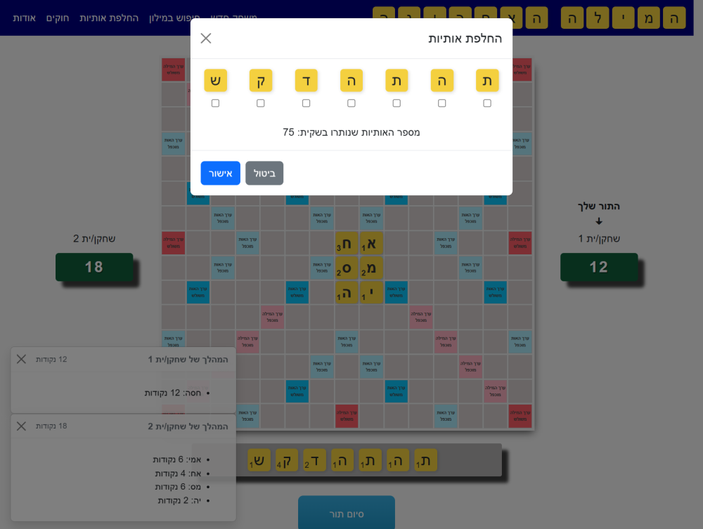

<h1>המילה האחרונה - משחק דמוי "שבץ נא" אונליין</h1>

זהו משחק דמוי "שבץ נא" אונליין לשני שחקנים מרוחקים (מעל גבי האינטרנט). 
ניתן לשחק במשחק <a href="https://the-last-word.onrender.com">כאן</a>.
קיימת גם גרסה נוספת של המשחק לשחק אחד (מול המחשב) או לשני שחקנים אשר חולקים מחשב מקומית, בה ניתן לשחק <a href="https://dvd848.github.io/the-last-word/">כאן</a>.

# The Last Word (Remote)

"The Last Word" is an online Scrabble™-like game in Hebrew. This version of the game supports an online match against a remote player. It's available [here](https://the-last-word.onrender.com).

In addition, a different version of the game supports playing the game individually against the computer or with a local partner in a two player mode. That version of the game is available online [here](https://dvd848.github.io/the-last-word/).

## Dictionary

By default, the game only accepts words which are included in its internal dictionary.  
Since the official Hebrew Scrabble™ is not freely available (if it even exists), 
the next best option was to base the dictionary on [Hspell](http://hspell.ivrix.org.il/), the Hebrew spell-check project.
However, this is far from being ideal for several reasons:
 1. The amount of words accepted by a spellchecker is much larger than the amount of words legal in Scrabble™. 
    For example, a spellchecker would accept "מכוניתי" and "מכוניותיכן" while in scrabble we might only want to accept "מכונית".
 2. Hspell was designed to be 100% and strictly compliant with the official niqqud-less spelling rules published by the Academy of the Hebrew Language. 
    However, a few of the Academia's official spelling decisions are relatively unknown to the general public, and sometimes even disputed by popular publishers.
    For example, it won't accept "אמא" (officially, the correct word is "אימא") or "אמיתי" (officially should be "אמתי").
 3. While probably being the most extensive source of Hebrew words openly available, it is not complete, and hasn't been updated for a few years.
 4. Hspell contains also names and other types of words which shouldn't be accepted in a Scrabble™ game.

Still, for the remote version of the game, weighing the advantages against the disadvantages, it was decided to include most of the words acceptable by Hspell, and avoid the mitigations offered in the local version of the game ("objections" and disabling the dictionary check completely). Details on the process of creating the game dictionary are available [here](https://github.com/Dvd848/the-last-word/tree/remote_game/utils/words).

## References

### Dictionary Storage

The dictionary is stored as a DAWG (Directed Acyclic Word Graph) which significantly reduces its size. 
In addition, given a prefix, this data structure allows iterating all the next-letters for all the words that start with the given prefix. 
Such an ability is needed in order to implement the algorithm listed above.

## Alternatives

There are a few alternatives for a Hebrew Scrabble™-like game online (see alternatives [here](https://github.com/Dvd848/the-last-word/blob/main/README.md)), however to date I'm 
not aware of any which offer a remote game between two players over the internet.

## Development

I developed this game as a follow-up to the local version (in the `main` branch) in order
to play around with AI-Assisted coding.
The project includes a Docker file that can be used to setup the game locally.  

### Developing / Running Locally

 1. Build the container with `docker-compose up -d --build`
 2. Run the container with `docker-compose up -d`
 3. Attach to the container with `docker-compose exec app sh`
 4. (First time only) Install the packages from `npm` using `npm install`
 5. (First time only) Install the server packages from `npm` using `cd server && npm install && cd ..`
 6. In one terminal, run `npm watch-client` to start watching client side code
 7. In another terminal, run `npm run dev` to start the server
 8. When done, execute `exit` to exit the shell
 9. Execute `docker-compose down` to stop the container

## License

"The Last Word" is released under [AGPLv3](https://www.gnu.org/licenses/agpl-3.0.en.html).

"The Last Word" utilizes the [Hspell](http://hspell.ivrix.org.il/) Dictionary as part of its functionality. This dictionary is released under [AGPLv3](https://www.gnu.org/licenses/agpl-3.0.en.html)

The dictionary's DAWG is generated by [dawgdic](https://code.google.com/p/dawgdic/) and is extracted on the client side by logic ported to Typescript from the [DAWG-Python](https://github.com/pytries/DAWG-Python) project (which was released under MIT license).

"The Last Word" is not officially affiliated with Scrabble™ or with Hasbro / Mattel.